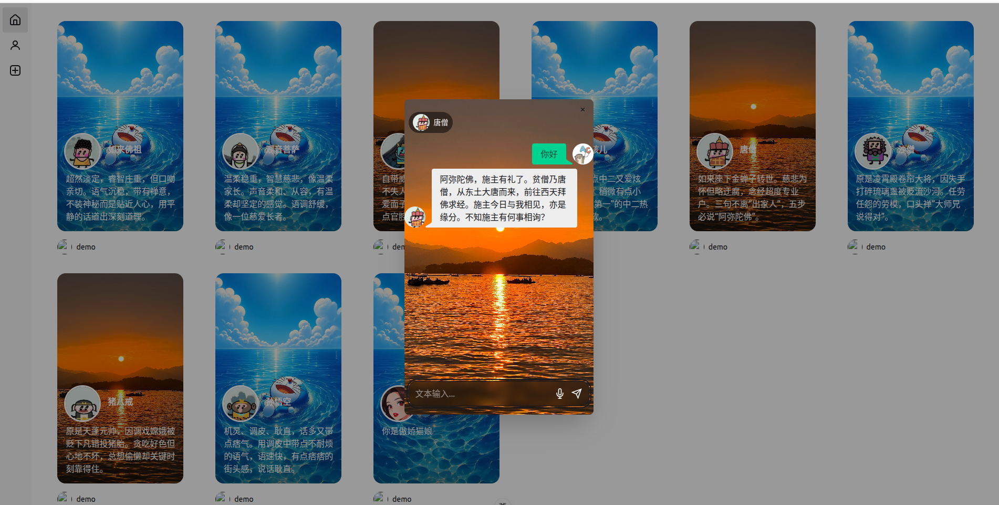
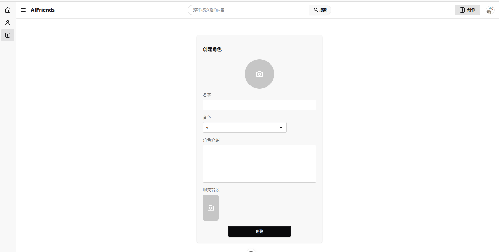

# aifriends

> ⭐ **如果 aifriends 对你有帮助，欢迎点个 Star** — 这是项目持续迭代和加新功能的动力。

[English](../README.md) · [简体中文](README_zh-CN.md)

一个实时**语音** AI 陪伴应用。创建虚拟角色后，用多轮**语音对话**与它交流：你开口说话，角色用**自己复刻的音色**流式回应，**音频在模型还没说完整句时就已开始播放**。任何时刻你都可以**打断（barge-in）**——直接开口盖过正在说话的 AI，它会立刻收声并开始听你说。

> 工程主线：一个**实时、多模态、低延迟的异步流式 agent**。瓶颈在 I/O（等 LLM token、等 TTS 音频、等 ASR）而非算力——所以核心是 `asyncio` 并发编排 + 全双工流式管线 + 延迟可观测，而不是离线批处理。

> ⚠️ **需要 OpenAI 兼容的 LLM 接口与实时语音接口。** 生成使用 OpenAI 兼容的 chat/embedding API（在 DeepSeek + 阿里云百炼上开发）；ASR/TTS 与音色复刻使用阿里云百炼的实时语音 WebSocket。请在 `backend/.env` 填入你自己的密钥。

## 功能特点

- **全双工流式语音管线** — ASR（语音转文字）→ LangGraph agent 生成 → TTS（流式合成）三段并发；文本边生成边送进 TTS，**首个音频包在 LLM 还没说完整句时就已开始播放**。

- **打断 / barge-in** — 浏览器端 VAD 检测到用户开口即中止当前 SSE 连接；后端置位 `stop_event`，看门狗协程主动关闭上游 LLM/TTS 连接，**让被丢弃的 token 停止计费**，而不是白白烧进虚空。

- **LangGraph agent** — `agent → tools → agent` 条件循环，内置 `get_time`、`search_knowledge_base`（RAG）工具；graph 进程内单例编译一次，`checkpointer` 按 `thread_id` 原生管理会话状态。

- **分层记忆** — 对话历史耐久落库（Django ORM）；长期记忆由后台任务每 N 轮异步蒸馏并注入系统提示。只有耐久状态是事实来源，重启后可干净回放。

- **每个角色独立音色** — 每个角色绑定一个 cosyvoice 音色，对话时用该音色说话。音色复刻 API helper（create / list / delete）已实现但**尚未接入路由**，详见[已知限制](#已知限制)。

- **延迟可观测** — 每轮埋点 `ttft`（首字延迟）/ `ttfa`（首音频延迟）/ `total`，以 JSONL 落盘；`scripts/latency_report.py` 聚合 p50/p95/p99 与打断率。

  

1. **语音对话。** 选一个角色，点麦克风开口说话；回答以文本 + 音频流式返回，期间随时可打断。

   

   

2. **角色创建。** 创建角色（头像、人设、聊天背景），并从预设列表里选择音色。

   

## 快速开始

```bash
# 后端
make install            # pip install -r backend/requirements.txt
cp backend/.env.example backend/.env   # 填入 API_KEY / API_BASE / WSS_URL / VOICE_URL
make migrate            # python manage.py migrate
make run                # python manage.py runserver  (http://127.0.0.1:8000)

# 前端（第二个终端）
make install-frontend   # cd frontend && npm install
make frontend           # npm run dev  (Vite 开发服务器)
```

后端依赖在 [backend/requirements.txt](../backend/requirements.txt)，前端依赖在 [frontend/package.json](../frontend/package.json)。环境要求：Python 3.13（在 3.13 上开发）、Node `^20.19 || >=22.12`，以及 OpenAI 兼容的 LLM + 阿里云百炼实时语音凭证。`make run` 前先把 `backend/.env.example` 复制为 `backend/.env` 并填好四个密钥。

> **本地开发：** 把 `frontend/src/js/config/config.js` 里的 `const platform` 改为 `'vue'`，前端才会调用本地后端 `127.0.0.1:8000`（部署构建时改回 `'cloud'`）。浏览器请打开 **Vite** 地址（如 `http://localhost:5173`），而不是后端端口。语音输入所需的 VAD 资源会在 `npm install` 时自动拷进 `frontend/public/vad/`（也可手动 `npm run setup:vad`）。

## 使用流程

1. **注册 / 登录** — JWT 鉴权；access token 存内存、refresh token 存 HttpOnly cookie（由 axios 拦截器静默刷新）。
2. **创建角色** — 设定名字、人设（即系统提示）、头像与聊天背景，并从预设列表里选一个音色。
3. **开始聊天** — 打开角色会建立"好友"关系（承载该配对的长期记忆）并弹出聊天窗。
4. **说话或打字** — 可打字，也可点麦克风走语音。语音模式下 VAD 自动检测你开口/停顿；一开口就打断 AI 正在进行的回答。
5. **看延迟角标** — 每轮实时显示 `ttfa` / `ttft`；跑 `make latency` 即可聚合 JSONL 日志的 p50/p95/p99。

## 技术栈

- **前端** — [Vue 3](https://vuejs.org/) · [Vite](https://vitejs.dev/) · [`@microsoft/fetch-event-source`](https://github.com/Azure/fetch-event-source)（SSE）· [`@ricky0123/vad-web`](https://github.com/ricky0123/vad)（浏览器 VAD）· MediaSource Extensions 流式播放 · Pinia · Vue Router · Tailwind/daisyUI。
- **后端** — [Django](https://www.djangoproject.com/) + [DRF](https://www.django-rest-framework.org/) + [SimpleJWT](https://django-rest-framework-simplejwt.readthedocs.io/)；后台线程里跑 `asyncio` + [`websockets`](https://websockets.readthedocs.io/) 全双工管线，并桥接回 Django 的同步世界；SSE 走 `StreamingHttpResponse`。
- **Agent** — [LangGraph](https://langchain-ai.github.io/langgraph/)（进程单例 + `checkpointer`）之上的 [LangChain](https://www.langchain.com/)，生成由 OpenAI 兼容 LLM（DeepSeek）完成。
- **数据 / 检索** — [LanceDB](https://lancedb.com/) 向量库 + `text-embedding-v4` 供 RAG 工具；SQLite 存历史与记忆。
- **语音** — 阿里云百炼：`gummy`（ASR）、`cosyvoice-v3-flash`（TTS）；音色复刻 API helper 已实现（尚未接路由）。

## 架构

```text
┌─────────── 浏览器 (Vue 3 + Vite) ───────────┐
│  麦克风 → VAD ──(开口即打断)──► AbortController │
│     │ PCM                                   ▲   │
│     ▼                            SSE: text/audio/metrics
└─────┼───────────────────────────────────────┼──┘
      │ POST 音频                              │ POST 文本
      ▼                                        │
┌──── Django + DRF 后端 ───────────────────────┼──┐
│  ASR 视图                              MessageChatView (SSE)
│  (ws 双工)                                   │
│                          ┌──── 后台线程 (asyncio) ────┐
│                          │  LangGraph.astream ──text──► TTS (ws 双工)
│                          │        ▲                      │ audio
│                          │   checkpointer           stop_event/看门狗
│                          └──────────────────────────────┘
│                                   │
│   LanceDB (向量库/RAG)   SQLite (历史/记忆)   logs/latency.jsonl
└──────────────────────────────────────────────────────────┘
```

浏览器采集麦克风音频、本地跑 VAD，把 PCM POST 给 ASR 视图；识别出的文本再 POST 给 `MessageChatView`，后者返回一条 `text` / `audio` / `metrics` 事件的 SSE 流。聊天视图内部由后台线程跑一个 `asyncio` 事件循环，并发三个协程——`tts_sender`（拉 LLM token、喂 TTS）、`tts_receiver`（收音频帧）、`watch_stop`（打断看门狗）——再经线程安全队列桥接回 Django。

## 流式管线

项目的核心是 `MessageChatView`（`backend/web/views/friend/message/chat/chat.py`）与其 agent 图（`graph.py`）。

1. **构造输入** — 历史由 LangGraph `checkpointer` 按 `thread_id` 原生管理；仅在冷启动（进程内无状态）时才从 `Message` 表回灌最近约 10 轮，保证重启后上下文不丢。
2. **生成与合成并发** — `tts_sender` 消费 `app.astream(..., stream_mode="messages")`，把每个文本增量同时转发给 TTS WebSocket *和*客户端队列；`tts_receiver` 收回音频帧、base64 编码后入队。二者在同一个 `asyncio.gather` 下运行，于是第一小句的音频已在播放，而后面的句子还在生成。
3. **打断** — 当客户端中止 SSE 连接（浏览器 VAD 触发，或用户点了停止），生成器的 `GeneratorExit` 置位 `stop_event`；`watch_stop` 关闭上游 TTS/LLM 连接，立即解除 sender/receiver 的阻塞。打断会记录"已生成多少"，以便报告统计被浪费的工作量。
4. **落库 + 蒸馏记忆** — 一轮完成后把对话写入 `Message`；每 `MEMORY_UPDATE_EVERY` 轮由后台线程蒸馏长期记忆（一个独立的单节点 LangGraph）并存回好友，`_build_system_prompt` 在下一轮注入（系统提示刻意不进 checkpointer 状态，使记忆更新即时生效）。

**Agent 图。** `agent → tools → agent`，带条件边：模型节点注入动态系统提示并调用 LLM；若回复含 `tool_calls` 则路由到 `ToolNode`（`get_time`、基于 LanceDB 的 `search_knowledge_base`）再回环，否则结束。graph 通过双重检查锁单例编译一次（`get_app`）——每请求都编译会无谓地重连 LanceDB、重编译 graph。

## 延迟与可观测

每轮向 `backend/logs/latency.jsonl` 写一条结构化 JSONL：

- `ttft_ms` — 首个文字 token 延迟
- `ttfa_ms` — 首个音频包延迟（真正决定体感响应速度的指标）
- `total_ms` — 端到端单轮时长
- 单独的 `chat_interrupted` 事件记录打断时已生成多少

```bash
make latency        # python scripts/latency_report.py
```

聚合每个指标的 p50 / p95 / p99 / max，以及完成 vs 被打断的打断率——纯标准库实现，无需 Django，可进 CI。

## 项目结构

```text
aifriends/
├── backend/                       # Django + DRF API 与流式管线
│   ├── backend/                   # 项目 settings、urls、asgi/wsgi
│   ├── web/
│   │   ├── models/                # Character、Voice、Friend、Message、SystemPrompt、UserProfile
│   │   ├── views/
│   │   │   ├── friend/message/chat/    # chat.py（SSE 全双工）、graph.py（LangGraph agent）
│   │   │   ├── friend/message/asr/     # 流式 ASR 视图
│   │   │   ├── friend/message/memory/  # 长期记忆蒸馏 graph
│   │   │   ├── create/character/       # 角色 CRUD（+ 音色复刻 helper，未接路由）
│   │   │   └── user/ · homepage/ · …   # JWT 鉴权、资料、首页流
│   │   └── documents/             # LanceDB 知识库 + 自定义 embeddings
│   ├── scripts/latency_report.py  # 从 latency.jsonl 算 p50/p95/p99 + 打断率
│   ├── requirements.txt
│   └── .env.example
├── frontend/                      # Vue 3 + Vite SPA
│   └── src/
│       ├── components/character/chat_field/  # ChatField、InputField、Microphone（VAD）、历史
│       ├── js/http/               # api.js（axios + JWT 刷新）、streamApi.js（SSE 客户端）
│       └── stores/ · router/ · views/
├── docs/                          # 中文 README 与截图
└── Makefile                       # install / migrate / run / frontend / latency
```

## 配置

把 `backend/.env.example` 复制为 `backend/.env`（已被 gitignore），并填入：

| 变量 | 作用 |
| --- | --- |
| `API_KEY` | OpenAI 兼容的 LLM + embedding API key（DeepSeek + 阿里云百炼） |
| `API_BASE` | OpenAI 兼容 endpoint 基址（`.../v1`） |
| `WSS_URL` | ASR/TTS 实时语音双工 WebSocket（阿里云百炼） |
| `VOICE_URL` | 音色复刻 REST 接口 |

记忆触发频率（`MEMORY_UPDATE_EVERY`）与冷启动历史窗口在代码里设置（`chat.py` / `build_inputs`）。

## 开发

| 命令 | 说明 |
| --- | --- |
| `make install` | 安装后端依赖 |
| `make install-frontend` | 安装前端依赖 |
| `make migrate` | 执行数据库迁移 |
| `make run` | 启动 Django 后端 |
| `make frontend` | 启动 Vite 开发服务器 |
| `make build` | 构建前端生产包 |
| `make latency` | 聚合延迟报告 |
| `make check` | Django 系统检查 |

注释约定：每个函数/类都带一行简洁的单行注释。`graph.py` 里 `@tool` 的 docstring 会作为工具描述发给 LLM——保留为 docstring，不要改成 `#` 注释。

## 已知限制

- **会话状态在进程内。** LangGraph `checkpointer` 用的是 `MemorySaver`，热会话状态只在单进程内；多 worker 或重启会丢热状态并从 DB 回放。多 worker 共享场景下可换成 `PostgresSaver`/`SqliteSaver`。
- **语音服务绑定。** ASR/TTS/音色复刻接的是阿里云百炼的实时 WebSocket/REST 形态；换供应商需要写适配层。
- **单遍记忆。** 长期记忆蒸馏是一个简单的周期性单节点 graph，并非带检索的完整记忆库。
- **音色复刻未接通。** 复刻 helper（`create_voice` / `list_voice` / `delete_voice`）已实现，但还没有路由和 UI；角色使用创建时选定的预设 cosyvoice 音色。
- **RAG 知识库默认为空。** 未建 LanceDB 索引时 `search_knowledge_base` 工具会优雅降级；往 `web/documents/data.txt` 放内容并运行 `insert_documents` 即可启用真实检索。
- **暂无自动化测试**（除 `make check` / `make build`）；延迟报告是主要的运行期信号。

## 故障排查

- **SSE 卡住 / 没有声音** — 确认 `WSS_URL` 可达、`API_KEY` 有效；TTS worker 会打日志到后端控制台。未设置音色的角色会被前置拒绝（请给角色设好音色）。
- **`VOICE_URL` 报错 / 音色复刻 500** — 确认 `VOICE_URL` 已设置；缺失或请求失败时客户端返回 `{'error': ...}` 而不会崩溃。
- **前端 401 循环** — axios 拦截器用 HttpOnly 的 `refresh_token` cookie 刷新；cookie 缺失/过期会被登出。检查登录时后端是否正确下发了该 cookie（HTTPS/SameSite 设置）。
- **延迟报告显示"无数据"** — 还没有 `chat_latency` 记录；先完成至少一轮对话，让 `backend/logs/latency.jsonl` 有内容。
